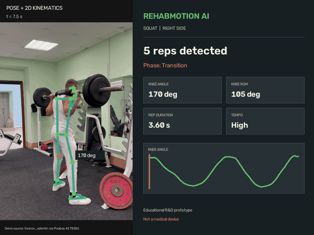
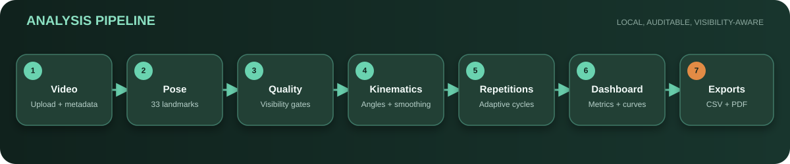

# RehabMotion AI

**Video-based 2D movement analysis for rehabilitation exercises.**


RehabMotion AI is a Python/Streamlit R&D prototype that turns a standard exercise video into auditable pose, kinematic and repetition metrics. It connects computer vision, signal processing and introductory biomechanics in one end-to-end portfolio project.

> **Medical disclaimer**
>
> This prototype is for educational and R&D purposes only. It is not a certified medical device and should not be used for diagnosis, treatment decisions or clinical monitoring.

<p align="center">
  
</p>

<p align="center">
  <a href="docs/assets/rehabmotion_demo.mp4">MP4 demo</a> ·
  <a href="output/pdf/rehabmotion_sample_report.pdf">Sample PDF report</a> ·
  <a href="docs/demo.md">Demo notes</a>
</p>

## At a glance

| | |
|---|---|
| **Input** | MP4, MOV or AVI exercise video |
| **Exercises** | Squat, sit-to-stand and knee flexion |
| **Core output** | Pose quality, knee/hip angles, trunk lean, ROM and repetitions |
| **Exports** | Landmarks CSV, kinematics CSV, repetitions CSV and PDF report |
| **Interface** | Persistent tabbed Streamlit dashboard |
| **Scope** | Educational single-person, single-camera 2D analysis |

## Analysis pipeline



1. Validate the video and extract metadata.
2. Run MediaPipe Pose Landmarker on sampled frames.
3. Reject low-visibility landmarks before metric calculation.
4. Compute aspect-ratio-corrected 2D knee, hip and trunk signals.
5. Smooth valid samples and detect complete movement cycles.
6. Present quality indicators, metrics, curves and repetition tables.
7. Export auditable frame-level data and a paginated PDF report.

## Demonstration result

The included portfolio demo uses a side-view squat clip and the default 0.60 visibility threshold. Values below describe this one recording and are **not clinical reference values**.

| Metric | Result |
|---|---:|
| Complete repetitions | 5 |
| Mean repetition duration | 3.60 s |
| Duration coefficient of variation | 6.5% |
| Tempo regularity heuristic | High |
| Whole-clip knee ROM | 105.4 deg |
| Mean per-repetition knee ROM | 102.4 deg |
| Whole-clip hip ROM | 108.7 deg |
| Maximum trunk lean | 32.1 deg |

## Features

### Computer vision and data quality

- MediaPipe Pose Landmarker in video mode with 33 landmarks.
- Configurable processing rate and visibility threshold.
- Reliable/low-confidence frame tracking and annotated skeleton preview.
- Automatic selection of the most visible left or right side.
- Pose inference cached independently from dashboard interactions.

### Biomechanics and signal processing

- Knee angle from hip-knee-ankle.
- Hip angle from shoulder-hip-knee.
- Unsigned trunk inclination from the image vertical.
- Pixel-space conversion before angles to preserve image aspect ratio.
- Savitzky-Golay smoothing with long confidence gaps kept missing.
- Range of motion and descriptive left-right asymmetry.

### Repetitions and reporting

- Adaptive hysteresis for complete extension-flexion-extension cycles.
- Exercise-aware phase labels for squat, sit-to-stand and knee flexion.
- Per-repetition duration, phase timing, ROM, trunk lean and asymmetry.
- Plotly curves with raw/smoothed signals and repetition overlays.
- Three-page A4 PDF with charts, metrics, limits and page numbering.
- Clear warnings instead of fabricated results when detection fails.

## Run locally

Python 3.11 or newer is recommended.

```bash
python -m venv .venv
python -m pip install -r requirements.txt
python -m streamlit run app/main.py
```

Activate the environment first if your shell requires it:

```powershell
# Windows PowerShell
.\.venv\Scripts\Activate.ps1
```

```bash
# macOS / Linux
source .venv/bin/activate
```

On the first real analysis, the application downloads the official MediaPipe Pose Landmarker Lite model into `data/models/`. Later analyses reuse the local model.

## Use the dashboard

1. Select the exercise and analysis settings in the sidebar.
2. Upload a video with one fully visible person and a stable camera.
3. Click **Run / refresh analysis**.
4. Review pose quality before interpreting the angle curves.
5. Inspect the repetition table and warnings.
6. Download CSV data or the PDF report from **Data & exports**.

Changing exercise, side or smoothing settings recomputes derived results without rerunning pose inference. Changing visibility or pose processing rate requires a refresh.

## Project structure

```text
app/                         Streamlit interface and charts
rehabmotion/
  analysis/                  Repetition metrics and report snapshots
  biomechanics/             Angles, smoothing, asymmetry and kinematics
  export/                    CSV and PDF generation
  pose/                      MediaPipe inference, landmarks and quality
  video/                     Video reading, annotation and writing
scripts/                     Reproducible portfolio-asset generation
tests/                       Unit, integration and app smoke tests
docs/                        Architecture, biomechanics, demo and limitations
output/pdf/                  Verified sample PDF report
```

More detail is available in [the architecture notes](docs/architecture.md) and [biomechanics notes](docs/biomechanics_notes.md).

## Tests and continuous integration

```bash
python -m pytest -q
```

The suite covers geometry, smoothing, pose quality, kinematics, repetition detection, movement metrics, annotation, video I/O, PDF generation and Streamlit startup. A GitHub Actions workflow runs the same suite on pushes and pull requests; the real MediaPipe smoke test skips automatically when the model is not cached.

## Design boundaries

- The system reports measurements and data quality; it does not diagnose or recommend treatment.
- Angles are 2D image-plane estimates, not calibrated 3D joint angles.
- Asymmetry is only reported when both sides are simultaneously visible.
- Adaptive thresholds and tempo labels are descriptive heuristics.
- Raw uploaded videos are processed through temporary local files and are not committed.

See [limitations](docs/limitations.md) for the complete list.

## Future improvements

- Calibrated multi-view or depth-based 3D reconstruction.
- Manual review and correction of repetition boundaries.
- Longitudinal session comparison with uncertainty intervals.
- Sensor fusion with IMU or EMG signals.
- Benchmarking against goniometry and motion-capture reference data.
- Clinical study design, validation and medical-device quality processes.
- Optional OpenSim-compatible biomechanical exports.

## Portfolio roadmap

- [x] Phase 1 - Video ingestion and metadata
- [x] Phase 2 - Pose estimation and landmark quality
- [x] Phase 3 - 2D kinematics and signal smoothing
- [x] Phase 4 - Repetition detection and per-repetition metrics
- [x] Phase 5 - Professional dashboard and CSV exports
- [x] Phase 6 - PDF analysis report
- [x] Phase 7 - Demo assets, architecture, CI and portfolio documentation

## Demo media

The transformed demo is credited to **tixonov_valentin via Pixabay**. Source and license records are documented in [ATTRIBUTION.md](docs/assets/ATTRIBUTION.md). The original video is intentionally excluded from the repository.
