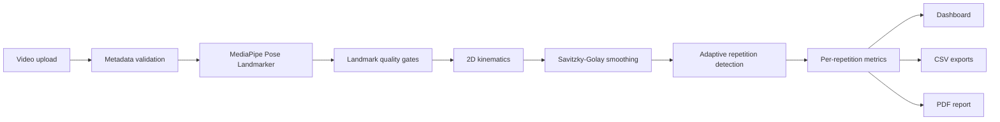

# Architecture

## Overview

RehabMotion AI separates video I/O, pose inference, biomechanics, repetition analysis, presentation and exports. The Streamlit layer orchestrates these modules but does not implement the calculations itself.

## Module responsibilities

| Module | Responsibility |
|---|---|
| `rehabmotion.video` | Read metadata, annotate frames and write demo clips |
| `rehabmotion.pose` | Run MediaPipe, serialize landmarks and assess quality |
| `rehabmotion.biomechanics` | Compute angles, smooth signals and describe asymmetry |
| `rehabmotion.analysis` | Detect cycles, compute metrics and assemble report snapshots |
| `rehabmotion.export` | Generate CSV-compatible data and the PDF report |
| `app.components` | Render Streamlit controls, charts, tabs and downloads |

## Data flow

1. The uploaded video is copied to a temporary local file for OpenCV and MediaPipe.
2. Pose inference produces long-format landmark records and per-frame quality records.
3. Landmark coordinates are converted from normalized values to pixel space.
4. Kinematics produces one row per sampled frame with raw and smoothed signals.
5. Repetition detection returns immutable cycle boundaries and adaptive thresholds.
6. Movement metrics create an auditable per-repetition table and a global summary.
7. The dashboard and report generator consume the same result objects.

## Caching and lifecycle

- Pose inference is cached by video bytes, visibility threshold and target processing rate.
- Exercise type, selected side and smoothing can update derived results without rerunning MediaPipe.
- Temporary uploaded-video files are removed in `finally` blocks.
- The pose model is cached under `data/models/` and excluded from version control.
- PDF bytes are cached while their report-data snapshot remains unchanged.

## Failure boundaries

- Invalid containers fail during metadata validation.
- Missing models and MediaPipe runtime errors become explicit application errors.
- Low visibility produces missing samples instead of forced angles.
- Insufficient signal excursion returns a repetition warning and an empty table.
- The PDF preserves `N/A` values rather than inventing measurements.

## Verification

The test suite covers pure geometry, signal smoothing, quality gating, kinematics, repetition segmentation, metrics, video I/O, PDF generation and application startup. Generated PDFs and portfolio media are additionally rendered and reviewed visually.
